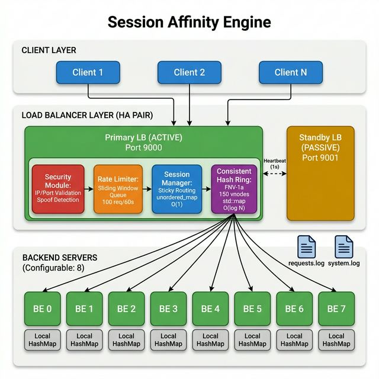
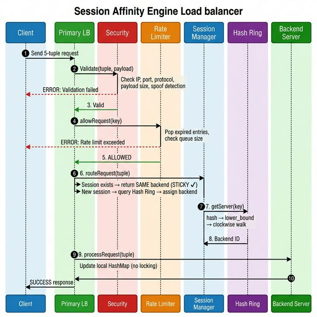
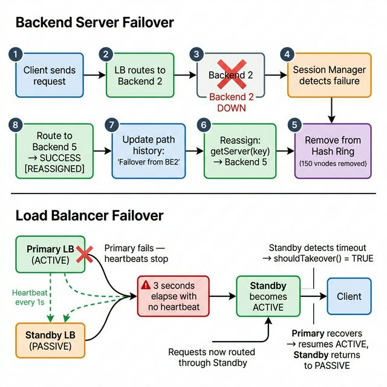
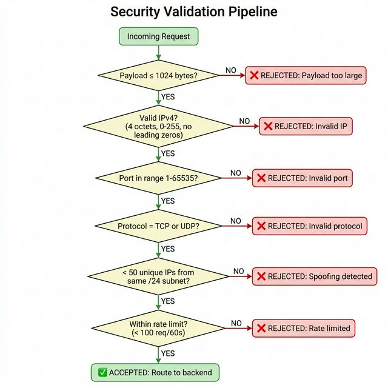

# Session Affinity Engine

A high-performance C++17 Layer-4 load balancer simulation that maintains **sticky sessions** using the 5-tuple `(src_ip, src_port, dst_ip, dst_port, protocol)`. Features consistent hashing for backend distribution, dual LB failover, sliding window rate limiting, and a multi-layered security pipeline.

**Tech**: C++17 · STL only · Zero external dependencies · 14/14 tests passing

---

## System Diagrams

### Architecture — Block Diagram

### Request Flow — Sequence Diagram

### Failover Scenarios — Backend & Load Balancer

### Security Validation — Flowchart

---

## Key Tradeoffs

| Decision | Why We Chose This | Tradeoff |
|----------|-------------------|----------|
| **`unordered_map` for sessions** | O(1) average lookup — critical for high throughput | O(N) worst-case on hash collisions; unordered iteration |
| **Consistent hashing (150 vnodes)** | Only ~12.5% of sessions redistribute when 1 of 8 servers fails | Distribution is approximate, not perfectly uniform |
| **Sliding window queue for rate limiting** | Exact fairness (no burst-at-boundary problem) + doubles as audit history | Stores one timestamp per request per client — more memory than a simple counter |
| **Lazy session expiry** | No background threads needed — simpler, no concurrency bugs | Dead sessions accumulate until `cleanupExpired()` is called |
| **Active-passive LB (not active-active)** | Zero split-brain risk — only one LB routes at a time | Standby sits idle, wasting resources until primary fails |

---

## Scope of Improvement

1. **Real network protocol support** — Replace in-process simulation with actual UDP sockets (`sendto()`/`recvfrom()`) for real client–server communication over the network

2. **Separate client binary** — Extract client logic into its own executable that sends requests to the LB over the network, making the system truly distributed

3. **Multithreaded request handling** — Use a thread pool to process requests in parallel across CPU cores, with each thread handling a subset of incoming connections

4. **Lock-free data structures** — Replace `std::mutex`-guarded `unordered_map` with a lock-free concurrent hash map (e.g., CAS-based) to eliminate contention on the session table hot path
